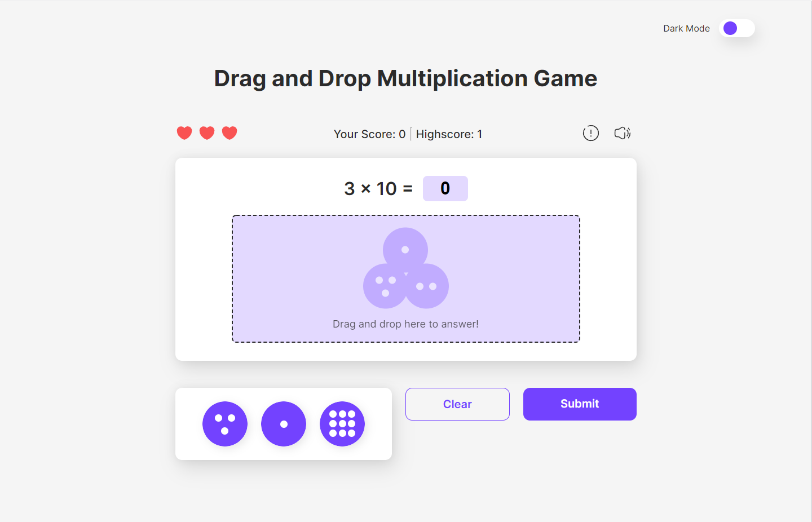

# DnD-Multiplication-Game
Multiplication Quiz Game using drag and drop features, built in HTML, CSS and JS.

## Features
1. Random Questions Generator
2. Drag and Drop Feature
3. Volume Settings
4. Dark Mode
5. Responsive Layout

### Preview Image

[Click here](https://dnd-multiplication-game.glitch.me) to preview the project.
